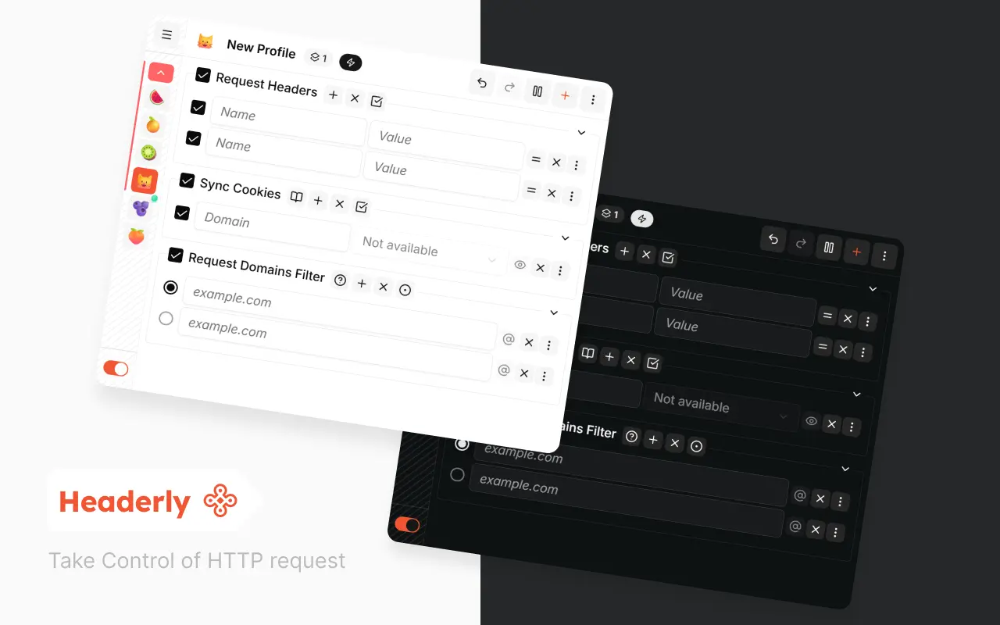

# Headerly

## Introduction

Headerly is a powerful and reliable browser extension for managing HTTP request/response headers and Chrome Declarative Net Request (DNR) rules. It helps developers and power users create reusable profiles that modify headers, allow or block requests, upgrade schemes, redirect traffic, and target rules precisely.

As an open-source project, Headerly provides a clean, user-friendly experience without injecting ads into your webpages.

## Downloads

- [Chrome Web Store](https://chromewebstore.google.com/detail/headerly/lmlapacaojgifapgjkbdkmaclkgcbhng)
- [Microsoft Edge Add-ons](https://microsoftedge.microsoft.com/addons/detail/headerly/dhkjobinnldebfgpondcjlefklcapnha)

## Key Features

- **DNR Action Types:** Create profiles for `modifyHeaders`, `allow`, `block`, `upgradeScheme`, `allowAllRequests`, and simple `redirect` actions.
- **Request & Response Header Rules:** Set, append, or remove request and response headers, with radio and checkbox groups for mutually exclusive or combinable variants.
- **Powerful Conditions:** Target rules with URL filters, regex filters, request/initiator/top-level domains, excluded domains, first-party or third-party matching, resource types, request methods, and case-sensitive URL matching.
- **Profile-Based Workflow:** Create, duplicate, pause, resume, delete, search, batch-manage, comment on, prioritize, and switch the action type of profiles.
- **Shareable Profiles:** Export one or more profiles as JSON, copy them to the clipboard, save them as a file, or share them with a compressed `headerly.dev/share` link.
- **Safe Import Flow:** Import profiles from JSON files, pasted JSON, or shared links, with schema validation before applying changes.
- **Cookie Synchronization:** Sync selected cookies into request headers when needed, with explicit cookies permission and warnings before sharing sensitive data.
- **Extension Controls & Recovery:** Toggle the extension on/off, view active rule counts in the badge, choose language/theme settings, and reinitialize all DNR rules when troubleshooting.

## Privacy Guarantee

Your privacy is our priority. Headerly relies on the `declarativeNetRequest` API, so the browser applies matching rules internally. The extension does not intercept, read, or analyze request payloads or response bodies. Cookie synchronization is optional and only runs after you grant the additional cookies permission.

## Screenshots

## Contribution

Please make sure to read the [Contributing Guide](./.github/CONTRIBUTING.md) before making a pull request.

This includes instructions on how to setup development environment, test extensions, and build the final product.

## Changelog

Detailed changes for each release are documented in the [CHANGELOG](./extension/CHANGELOG.md).

## License

MIT | © 2026 aiktb made with ❤️.
